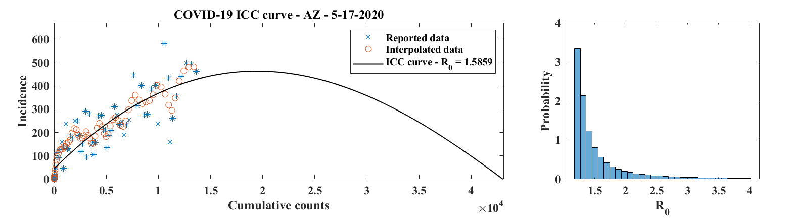
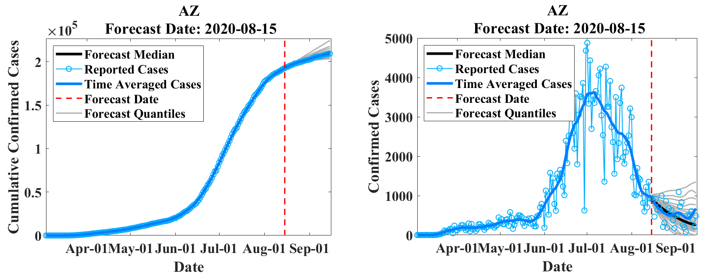

# EpiGro

EpiGro is a disease outbreak forecasting tool. It started ([v.1.0](#epigro-v10)) as a phenonmenological model that described incidence as a quadratic function of the cumulative number of cases. [Version 2.0](#epigro-v20) incorporated the exact definition of the ICC (Incidence - Cumulative Cases) curve for the SIR model, thereby transforming EpiGro into a mechanistic model. [Version 3.0](#epigro-v30---epicovda), developed for COVID-19 forecasting, combines the mechanistic approach of EpiGro (v.2.0) with variational data assimilation techniques.

## EpiGro v.1.0
### Model
EpiGro v.1.0 was developed in response to the [DARPA Chikungunya Challenge](https://www.innocentive.com/ar/challenge/9933617) and is described in [Lega & Brown (2016)](http://dx.doi.org/10.1016/j.epidem.2016.10.002). The approach relies on the empirical observation that weekly incidence data for the 2014 outbreak of chikungunya in Guadeloupe, plotted as a function of the cumulative number of cases, can be fitted with a parabola. This simple fact means that the cumulative number of cases may in turn be approximated by a quantity that follows logistic growth, confirming previous observations reported in the literature for other diseases ([Chowell et al., 2014](https://doi.org/10.1371/currents.outbreaks.b4690859d91684da963dc40e00f3da81)).

EpiGro [won the DARPA Challenge](https://www.darpa.mil/news-events/2015-05-27) and an analysis of the methods used by challenge participants revealed that simpler models generally performed better than complex ones ([Del Valle et al., 2018](http://dx.doi.org/10.1186/s12879-018-3124-7)). More details on our approach may be found on our [chikungunya modeling challenge site](http://www.u.arizona.edu/~lega/CHIK_Site/CHIK_Challenge.html).

### Release
The codes released for EpiGro v.1.0 consist of a MATLAB Graphical User Interface (GUI) that compares cumulative epidemiological data to logistic growth, by fitting a prabola to incidence (growth rate) plotted as a function of the cumulative cases. Users may import their own epidemiological data or select some of the datasets provided. The GUI also allows to model outbreaks that are comprised of two separate waves (via the two-parabola option).

## EpiGro v.2.0
### Model
EpiGro v.2.0 fits outbreak epidemiological data to the ICC curve of the SIR model. The exact formulation, derived in [Lega (2020)](http://arxiv.org/abs/2005.08134), is given by

where *I* is incidence, &beta; is the contact rate of the disease, *C* is the cumulative number of cases, *N* is the size of the population, *R*0 is the basic reproductive number, and &kappa; represents initial conditions. 

The following results are also established in <a href="http://arxiv.org/abs/2005.08134">Lega (2020)</a>.

1. Solving the differential equation given by the above ICC curve (with incidence *I* equal to the time derivative of *C*) is equivalent to solving the SIR model.
2. For fixed *N*, there is a unique set of parameter values &beta;, *R*0, and &kappa; that minimizes the RMSE between the resulting ICC curve and the data points. This form of itentifiability is one of the main advantages of fitting ICC curves, rather than epidemiological curves, to outbreak data.

Due to its equivalence with the SIR model, EpiGro v.2.0 is a mechanistic approach that fits a SIR model to outbreak data.

### Release
The MATLAB codes provided for version 2.0 of EpiGro find the ICC curve associated with user-provided epidemiological data, estimate ranges of suitable parameter values in the presence of reporting noise, and describe a method to find a range of values of $N$ if the latter variable is unknown. Simple forecasting based on a fit of the ICC curve to the data is also discussed.

## EpiGro v.3.0 - EpiCovDA
### Model
EpiGro v.3.0, or EpiCovDA combines variational data assimilation methods with the exact formulation of the SIR ICC curve, to provide forecasts for ongoing outbreaks. Details will be provided in Biegel & Lega (2020). The model assumes that current interventions (such as social-distancing measures or stay-at-home orders) will remain in effect for at least four weeks after the forecasts are made.

Priors are found by processing the early stages of the outbreak data with EpiGro v.2.0. The data assimilation step identifies parameters by minimizing a cost function that combines distance from prior values as well as distance between data points collected in the last 3 to 7 days and the parametrized ICC curve. Forecasts are obtained by integration of ICC curves for parameter values in the posterior distribution, followed by resampling of the results with a normal distribution.

## License
 This work is licensed under a <a rel="license" href="http://creativecommons.org/licenses/by-nc-sa/4.0/">Creative Commons Attribution-NonCommercial-ShareAlike 4.0 International License</a>.
See [LICENSE.txt](https://github.com/JocelineLega/EpiGro/blob/master/LICENSE.txt) in this repository for additional information.
